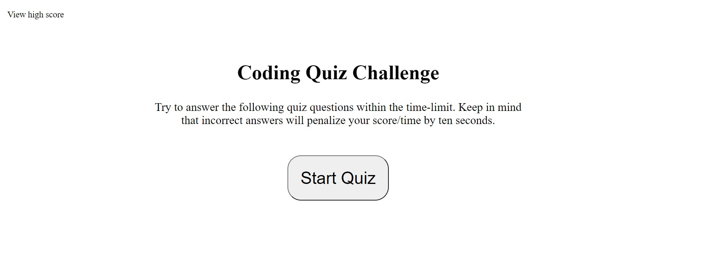
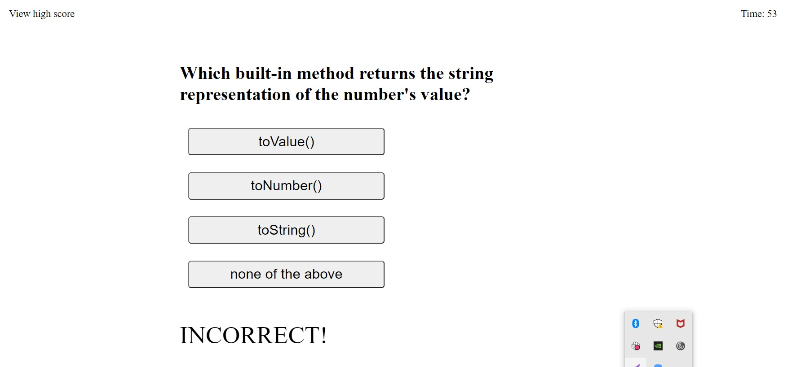
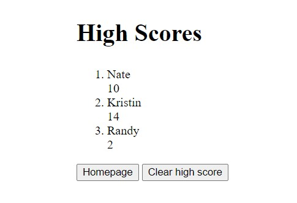

# Code Quiz Challenge

## Purpose
Develop a quiz to test the users knowledge of javaScript fundamentals.  Keep the user's score then list that in order on a high score page.

## Features
* From the homepage the user will be able to either start the quiz or see the scores on the high score page.
* During the quiz the score is kept and time is deducted by ten seconds each time and answer is incorrect.
* The user sees a prompt at the bottom of the page to know if the last answer was correct or incorrect.
* The quiz ends when either the timer reaches 0 or the questions are all over.
* After the quiz is complete the user is able to enter their name or initials to keep their score in local storage or just skip to the high score page.
* The user can see all the scores listed in order and from there can either go to the homepage to take the quiz again or clear the high scores.

## Built With
* HTML
* CSS
* javaScript

## Website
https://n8dogg59.github.io/quiz-challenge/

## Github Repository
https://github.com/n8dogg59/quiz-challenge

## Screenshot

### Contribution
Created by Nate Schroeder